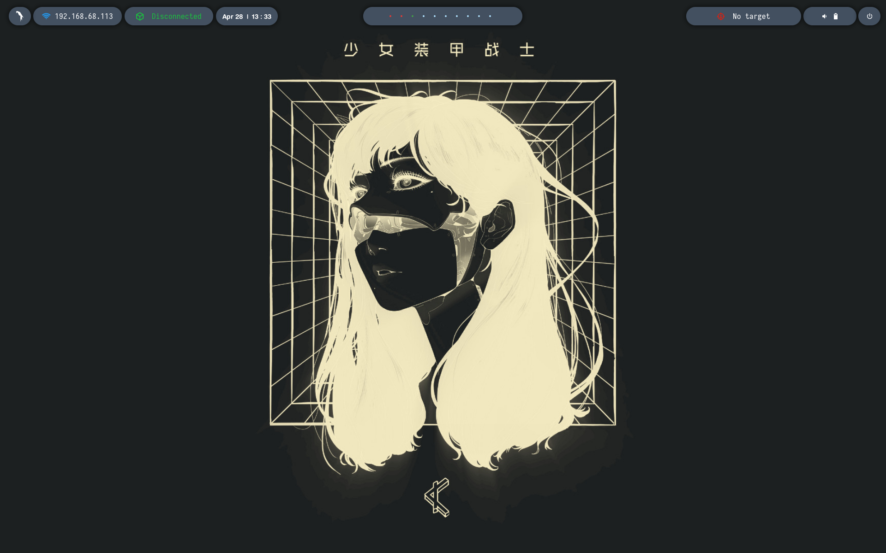
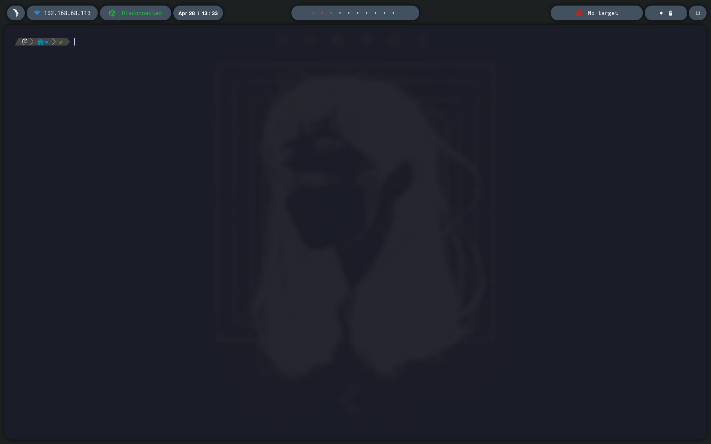
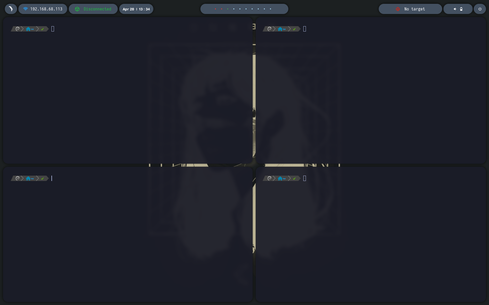

# autobspwm-parrot

`autobspwm-parrot` es un proyecto de automatización para replicar un entorno personalizado de Parrot OS basado en `bspwm`.

El repositorio contiene configuraciones, scripts, assets, listas de paquetes y utilidades de backup/restore para instalar el entorno en un Parrot OS limpio de forma reproducible, segura e idempotente.

## Capturas

Vista general del escritorio con wallpaper, polybar y módulos de estado:



Kitty con transparencia, blur de fondo, prompt Powerlevel10k y bordes redondeados:



Layout tiling de `bspwm` con varias ventanas de kitty:



## Características

- Instala y configura `bspwm`, `sxhkd`, `polybar`, `kitty`, `rofi`, `picom`, GTK, iconos, cursor, fuentes y wallpapers.
- Copia configuraciones personales de terminal, shell y aplicaciones de personalización.
- Crea backups automáticos antes de sobrescribir archivos.
- Permite restaurar backups previos.
- Permite desinstalar la configuración instalada sin borrar datos personales.
- Incluye un comando `check` para validar rutas, permisos, comandos, paquetes y referencias inseguras.
- Excluye explícitamente credenciales, secretos, montajes, servicios externos y rutas sensibles.
- Soporta instalación mínima del entorno principal o instalación extendida con paquetes opcionales.

## Estado Del Proyecto

El proyecto fue generado desde un sistema Parrot OS personalizado y saneado para uso portable.

No incluye secretos, claves privadas, credenciales ni configuraciones de acceso a servicios externos.

## Requisitos

Sistema recomendado:

- Parrot OS o distribución Debian-based.
- Sesión X11.
- Usuario normal con permisos `sudo`.
- Conexión a internet para `apt update`, instalación de paquetes y clonado opcional de Powerlevel10k.
- Bash disponible.

No ejecutes el instalador como `root`. El script instalará paquetes con `sudo` cuando sea necesario, pero las configuraciones se aplican al usuario actual.

## Instalación Del Repositorio

Clona o copia el proyecto en el sistema destino:

```bash
git clone <URL_DEL_REPOSITORIO> autobspwm-parrot
cd autobspwm-parrot
```

Si ya tienes la carpeta copiada manualmente:

```bash
cd ~/autobspwm-parrot
```

Da permisos de ejecución si fuese necesario:

```bash
chmod +x autobspwm install.sh backup.sh restore.sh uninstall.sh check.sh
```

## Uso Rápido

Validar el proyecto:

```bash
./autobspwm check
```

Crear backup manual:

```bash
./autobspwm backup
```

Instalar entorno principal:

```bash
./autobspwm install
```

Instalar entorno principal y paquetes secundarios opcionales:

```bash
./autobspwm install --with-optional
```

Restaurar último backup:

```bash
./autobspwm restore
```

Desinstalar configuración:

```bash
./autobspwm uninstall
```

## Comando Principal

El punto de entrada es:

```bash
./autobspwm <comando> [opciones]
```

Comandos disponibles:

| Comando | Descripción |
| --- | --- |
| `install` | Instala paquetes requeridos, crea backup y copia configuraciones. |
| `backup` | Crea un backup timestamped de las configuraciones soportadas. |
| `restore` | Restaura el último backup o uno específico. |
| `uninstall` | Retira configuraciones instaladas y ofrece restaurar backup. |
| `check` | Valida estado del proyecto, comandos, paquetes y seguridad. |
| `help` | Muestra ayuda básica. |

## Parámetros Y Variables

### `install`

Instalación estándar:

```bash
./autobspwm install
```

Instalación con paquetes opcionales:

```bash
./autobspwm install --with-optional
```

Equivalente usando variable de entorno:

```bash
INSTALL_OPTIONAL=1 ./autobspwm install
```

La instalación estándar usa:

```bash
packages/apt.txt
```

La instalación extendida añade:

```bash
packages/optional.txt
```

### `backup`

Crear backup:

```bash
./autobspwm backup
```

Ruta generada:

```bash
~/.backup-autobspwm/YYYY-MM-DD_HH-MM-SS/
```

### `restore`

Restaurar último backup:

```bash
./autobspwm restore
```

Restaurar backup específico:

```bash
./autobspwm restore 2026-04-28_13-30-00
```

Antes de restaurar, el script muestra las rutas afectadas y solicita confirmación.

### `uninstall`

Desinstalar configuración instalada:

```bash
./autobspwm uninstall
```

El uninstall:

- mueve configuraciones instaladas a `~/.backup-autobspwm/uninstall_YYYY-MM-DD_HH-MM-SS/`.
- ofrece restaurar el último backup.
- pregunta explícitamente antes de eliminar paquetes apt.
- no borra datos personales.

### `check`

Validar proyecto:

```bash
./autobspwm check
```

El check valida:

- rutas esperadas dentro del proyecto.
- permisos ejecutables.
- comandos principales del entorno.
- comandos opcionales si existen.
- paquetes requeridos y opcionales.
- referencias no portables o excluidas en `config/` y `system/`.

Los paquetes que no están instalados localmente pero existen en repositorios apt se reportan como `INFO`, no como error. Esto evita falsos positivos cuando el sistema actual tiene binarios instalados en `/opt` o `/usr/local`.

## Estructura Del Proyecto

```text
autobspwm-parrot/
├── autobspwm
├── install.sh
├── backup.sh
├── restore.sh
├── uninstall.sh
├── check.sh
├── README.md
├── lib/
│   └── common.sh
├── packages/
│   ├── apt.txt
│   ├── optional.txt
│   ├── pip.txt
│   └── manual.txt
├── config/
│   ├── bspwm/
│   ├── sxhkd/
│   ├── polybar/
│   ├── kitty/
│   ├── rofi/
│   ├── picom/
│   ├── gtk-2.0/
│   ├── gtk-3.0/
│   ├── gtk-4.0/
│   ├── zsh/
│   ├── nvim/
│   ├── fonts/
│   ├── wallpapers/
│   ├── scripts/
│   └── ...
├── system/
│   ├── desktop-files/
│   ├── services/
│   └── xsession/
└── logs/
```

## Configuraciones Incluidas

Entorno principal:

- `bspwm`: `bspwmrc`, reglas de ventana, arranque de `sxhkd`, `polybar`, `picom`, wallpaper y touchpad.
- `sxhkd`: atajos de teclado para bspwm, terminal, rofi, volumen, brillo, screenshots, monitor layout y bloqueo.
- `polybar`: múltiples barras, launchers, powermenu, módulos de red/VPN/target, fuentes y temas internos.
- `kitty`: configuración, colores, fuente, transparencia y atajos.
- `rofi`: configuración y temas.
- `picom`: sombras, blur, opacidad y bordes redondeados.
- GTK 2/3/4: temas, preferencias, bookmarks saneados.
- `xsettingsd`: integración visual para apps GTK.
- `zsh`: `.zshrc`, aliases, funciones, Powerlevel10k y plugins.
- `Powerlevel10k`: se clona en `~/powerlevel10k` si no existe y hay internet.
- `wallpapers`: fondos locales usados por el entorno.
- `fonts`: fuentes locales necesarias para polybar y terminal.
- `flameshot`: configuración de capturas.
- `touchpad`: script `toggle-touchpad-synclient`.

Aplicaciones y personalización adicional:

- `nvim`: configuración NvChad, tema `bearded-arc`, plugins declarados y `lazy-lock.json`.
- `neofetch`: configuración visual.
- `htop`: layout y preferencias.
- `geany`: tema, fuentes y preferencias.
- `lxterminal` y `xfce4-terminal`: configuración capturada.
- `Konsole`: perfiles y esquema `GreenOnBlack`.
- `mimeapps.list`: asociaciones de aplicaciones.
- VS Code/Windsurf: solo `settings.json` y keybindings seguros.

Perfiles secundarios capturados:

- `i3`
- `openbox`
- `lxpanel`
- `pcmanfm`
- launchers MATE seleccionados
- apariencia LXQt segura

Estos perfiles secundarios se copian como configuración, pero sus paquetes se instalan solo si usas `--with-optional`.

## Paquetes

Paquetes requeridos:

```bash
packages/apt.txt
```

Paquetes opcionales para perfiles secundarios:

```bash
packages/optional.txt
```

Paquetes pip:

```bash
packages/pip.txt
```

Actualmente no hay paquetes pip requeridos.

Elementos manuales:

```bash
packages/manual.txt
```

## Flujo Recomendado En Parrot Limpio

1. Instala Parrot OS.

2. Actualiza el sistema base si lo deseas:

```bash
sudo apt update
sudo apt upgrade
```

3. Clona el repositorio:

```bash
git clone <URL_DEL_REPOSITORIO> autobspwm-parrot
cd autobspwm-parrot
```

4. Ejecuta el check inicial:

```bash
./autobspwm check
```

5. Instala el entorno principal:

```bash
./autobspwm install
```

6. Opcionalmente instala perfiles secundarios:

```bash
./autobspwm install --with-optional
```

7. Cierra sesión.

8. En el login manager selecciona:

```text
bspwm autobspwm
```

9. Inicia sesión y valida:

```bash
./autobspwm check
```

## Backups

El instalador ejecuta backup automáticamente antes de sobrescribir configuraciones.

También puedes ejecutar backup manual:

```bash
./autobspwm backup
```

Los backups se guardan en:

```bash
~/.backup-autobspwm/YYYY-MM-DD_HH-MM-SS/
```

El backup cubre configuraciones de entorno gráfico, shell, terminales y apps de personalización soportadas.

No respalda secretos, tokens, claves privadas, configuraciones de acceso externo ni almacenamiento remoto.

## Restauración

Restaurar último backup:

```bash
./autobspwm restore
```

Restaurar uno específico:

```bash
./autobspwm restore YYYY-MM-DD_HH-MM-SS
```

El script solicita confirmación antes de restaurar.

## Desinstalación

```bash
./autobspwm uninstall
```

La desinstalación:

- mueve configuraciones instaladas a un backup de uninstall.
- ofrece restaurar el último backup disponible.
- pregunta antes de eliminar paquetes.
- no toca datos personales no gestionados por este proyecto.

## Monitores

El script de layout está en:

```bash
config/bspwm/scripts/monitor_layout.sh
```

Usa `xrandr` para detectar monitor interno y externo.

Atajos definidos:

| Atajo | Acción |
| --- | --- |
| `Super + Alt + e` | Extender monitor externo a la izquierda. |
| `Super + Alt + m` | Duplicar pantallas. |
| `Super + Alt + Shift + m` | Duplicar con escalado. |
| `Super + Alt + i` | Usar solo monitor interno. |

Si tu hardware usa resoluciones diferentes, ajusta:

```bash
TARGET_INT_MODE="1920x1200"
TARGET_EXT_MODE="1920x1080"
```

## Atajos De Teclado

Los atajos están definidos en:

```bash
config/sxhkd/sxhkdrc
```

### Aplicaciones Y Control General

| Atajo | Acción |
| --- | --- |
| `Super + Enter` | Abre `kitty`. |
| `Super + d` | Abre `rofi -show run`. |
| `Super + Escape` | Recarga la configuración de `sxhkd`. |
| `Super + Shift + f` | Abre Firefox. |
| `Super + Shift + s` | Abre `flameshot gui` para capturas. |
| `Super + e` | Abre Caja. |
| `Super + Alt + t` | Alterna el touchpad usando `toggle-touchpad-synclient`. |
| `Super + Shift + x` | Bloquea sesión con `i3lock-fancy`. |

### Control De bspwm

| Atajo | Acción |
| --- | --- |
| `Super + Shift + q` | Cierra `bspwm`. |
| `Super + Shift + r` | Reinicia `bspwm`. |
| `Super + q` | Cierra la ventana enfocada. |
| `Super + Shift + q` | Mata la ventana enfocada. |
| `Super + m` | Alterna entre layout tiled y monocle. |
| `Super + y` | Envía el nodo marcado más reciente al nodo preseleccionado más reciente. |
| `Super + g` | Intercambia la ventana actual con la ventana más grande. |

Nota: `Super + Shift + q` está definido tanto para `bspc quit` como para matar ventana por la expansión de llaves de `sxhkd`. Si notas comportamiento ambiguo, conviene separar esos binds.

### Estados Y Flags De Ventana

| Atajo | Acción |
| --- | --- |
| `Super + t` | Cambia la ventana a tiled. |
| `Super + Shift + t` | Cambia la ventana a pseudo tiled. |
| `Super + s` | Cambia la ventana a floating. |
| `Super + f` | Cambia la ventana a fullscreen. |
| `Super + Ctrl + m` | Alterna flag marked. |
| `Super + Ctrl + x` | Alterna flag locked. |
| `Super + Ctrl + y` | Alterna flag sticky. |
| `Super + Ctrl + z` | Alterna flag private. |

### Foco, Swap Y Escritorios

| Atajo | Acción |
| --- | --- |
| `Super + Left/Down/Up/Right` | Enfoca ventana hacia izquierda/abajo/arriba/derecha. |
| `Super + Shift + Left/Down/Up/Right` | Intercambia ventana hacia izquierda/abajo/arriba/derecha. |
| `Super + p` | Enfoca el nodo padre. |
| `Super + b` | Enfoca el nodo hermano. |
| `Super + comma` | Enfoca el primer nodo. |
| `Super + period` | Enfoca el segundo nodo. |
| `Super + c` | Enfoca la siguiente ventana del escritorio actual. |
| `Super + Shift + c` | Enfoca la ventana anterior del escritorio actual. |
| `Super + bracketleft` | Enfoca el escritorio anterior del monitor actual. |
| `Super + bracketright` | Enfoca el escritorio siguiente del monitor actual. |
| `Super + grave` | Enfoca el último nodo. |
| `Super + Tab` | Enfoca el último escritorio. |
| `Super + o` | Enfoca el nodo anterior en el historial de foco. |
| `Super + i` | Enfoca el nodo siguiente en el historial de foco. |
| `Super + 1-9,0` | Cambia al escritorio 1-10. |
| `Super + Shift + 1-9,0` | Envía la ventana actual al escritorio 1-10. |

### Preselección

| Atajo | Acción |
| --- | --- |
| `Super + Ctrl + Alt + Left/Down/Up/Right` | Preselecciona dirección para la próxima ventana. |
| `Super + Ctrl + 1-9` | Define ratio de preselección `0.1` a `0.9`. |
| `Super + Ctrl + Alt + Space` | Cancela preselección del nodo enfocado. |
| `Super + Ctrl + Shift + Space` | Cancela preselección de todo el escritorio actual. |

### Movimiento Y Resize

| Atajo | Acción |
| --- | --- |
| `Super + Ctrl + Shift + Left/Down/Up/Right` | Mueve una ventana flotante en pasos de 20 px. |
| `Super + Alt + Left/Down/Up/Right` | Redimensiona con `bspwm_resize`; usa pasos distintos para ventanas tiled/floating. |

### Audio, Brillo Y Monitores

| Atajo | Acción |
| --- | --- |
| `XF86AudioRaiseVolume` | Sube volumen 5% y desmutea. |
| `XF86AudioLowerVolume` | Baja volumen 5%. |
| `XF86AudioMute` | Alterna mute. |
| `XF86MonBrightnessUp` | Sube brillo 5%. |
| `XF86MonBrightnessDown` | Baja brillo 5%. |
| `Super + Alt + e` | Extiende monitor externo a la izquierda. |
| `Super + Alt + m` | Duplica pantallas. |
| `Super + Alt + Shift + m` | Duplica pantallas con escalado. |
| `Super + Alt + i` | Usa solo monitor interno. |

## Seguridad Y Exclusiones

Este proyecto excluye explícitamente:

- credenciales, secretos, tokens y claves privadas.
- configuraciones de acceso a servicios externos.
- configuraciones de almacenamiento remoto o montajes persistentes.
- archivos de identidad, password stores y llaveros personales.
- historiales, cachés, `globalStorage` y estados internos de editores.
- repositorios internos de configuración, como `.git` dentro de configs copiadas.
- autostarts de servicios externos o compartición de archivos.
- paneles o atajos de escritorio relacionados con montajes.

Las integraciones locales no portables fueron retiradas de las configuraciones incluidas.

## Idempotencia

El instalador está diseñado para ejecutarse más de una vez:

- crea backup antes de copiar.
- copia configuraciones sobre rutas esperadas.
- mantiene fuentes en `~/.local/share/fonts/autobspwm`.
- conserva backups previos.
- no elimina paquetes sin confirmación.

## Logs

Los logs se generan en:

```bash
logs/autobspwm-YYYY-MM-DD_HH-MM-SS.log
```

Consultar último log:

```bash
ls -t logs/autobspwm-*.log | head -n 1
tail -n 120 "$(ls -t logs/autobspwm-*.log | head -n 1)"
```

## Troubleshooting

### `check` muestra paquetes no instalados como `INFO`

Eso no necesariamente es un problema. Significa que el paquete existe en apt, pero no está instalado en el sistema actual.

Ejemplo: si `kitty` existe en `/opt/kitty/bin/kitty`, el comando puede funcionar aunque dpkg no lo marque como instalado.

### `picom`, `kitty` o `nvim` funcionan pero aparecen como no instalados por paquete

Es normal si fueron instalados manualmente en `/opt` o `/usr/local`. En un Parrot limpio, el instalador intentará instalar los paquetes desde apt.

### No aparece la sesión de bspwm

Verifica que exista:

```bash
ls /usr/share/xsessions/bspwm-autobspwm.desktop
```

Si no existe, vuelve a ejecutar:

```bash
./autobspwm install
```

### Polybar no se ve correctamente

Revisa fuentes:

```bash
fc-cache -fv
fc-match "Iosevka Nerd Font"
```

Reinicia bspwm:

```bash
bspc wm -r
```

### Rofi o GTK no toman el tema

Ejecuta:

```bash
gsettings get org.gnome.desktop.interface gtk-theme
gsettings get org.gnome.desktop.interface icon-theme
```

Si usas XFCE:

```bash
xfconf-query -c xsettings -p /Net/ThemeName
```

## Desarrollo

Validar sintaxis Bash:

```bash
bash -n autobspwm install.sh backup.sh restore.sh uninstall.sh check.sh lib/common.sh
```

Validar el proyecto:

```bash
./autobspwm check
```

Buscar referencias sensibles antes de publicar:

```bash
rg -n '/home/|credential|token|secret|password|private|key|mount|remote|server' config system
```

## Licencia

Este proyecto está publicado bajo una licencia no comercial personalizada.

Copyright (c) 2026 TomasGutierrezOrozco.

No está permitido vender, sublicenciar, monetizar, revender, empaquetar como producto de pago ni usar este proyecto o derivados con fines comerciales sin permiso explícito por escrito del autor.

Consulta [LICENSE](LICENSE) para los términos completos.

## Aviso

Revisa siempre `packages/apt.txt`, `packages/optional.txt` y `config/` antes de ejecutar el instalador en un sistema de trabajo. Aunque el proyecto crea backups, modificar configuraciones de escritorio puede afectar la sesión gráfica actual del usuario.

---

# English Documentation

`Autobspwm-ParrotOS` is an automation project for reproducing a customized Parrot OS desktop environment based on `bspwm`.

The repository contains user configuration files, installation scripts, wallpapers, fonts, package lists, backup utilities and restore/uninstall helpers. It is designed to bootstrap the same visual environment on a clean Parrot OS installation while keeping the process reproducible, safe and idempotent.

## Features

- Installs and configures `bspwm`, `sxhkd`, `polybar`, `kitty`, `rofi`, `picom`, GTK settings, icons, cursor theme, fonts and wallpapers.
- Copies shell, terminal and application customization files.
- Creates automatic backups before modifying existing user configuration.
- Restores previous backups.
- Removes installed configuration safely through an uninstall workflow.
- Provides a `check` command to validate paths, permissions, commands, packages and sensitive references.
- Excludes credentials, secrets, external-service access configuration, persistent mounts and sensitive local state.
- Supports a standard installation and an extended installation with optional secondary desktop profiles.

## Requirements

Recommended target system:

- Parrot OS or another Debian-based distribution.
- X11 session.
- Regular user with `sudo` privileges.
- Internet connection for `apt update`, package installation and optional Powerlevel10k cloning.
- Bash.

Do not run the installer as `root`. The installer uses `sudo` only when system-level package installation is required. User configuration is applied to the current user.

## Quick Start

Clone the repository:

```bash
git clone <REPOSITORY_URL> Autobspwm-ParrotOS
cd Autobspwm-ParrotOS
```

Make scripts executable if needed:

```bash
chmod +x autobspwm install.sh backup.sh restore.sh uninstall.sh check.sh
```

Validate the project:

```bash
./autobspwm check
```

Install the main environment:

```bash
./autobspwm install
```

Install the main environment plus optional secondary profiles:

```bash
./autobspwm install --with-optional
```

After installation, log out and select:

```text
bspwm autobspwm
```

## Main Command

Entry point:

```bash
./autobspwm <command> [options]
```

Available commands:

| Command | Description |
| --- | --- |
| `install` | Installs packages, creates a backup and copies configuration files. |
| `backup` | Creates a timestamped backup of supported configuration paths. |
| `restore` | Restores the latest backup or a selected backup. |
| `uninstall` | Removes installed configuration and offers backup restoration. |
| `check` | Validates project files, commands, packages and sensitive references. |
| `help` | Shows basic usage information. |

## Install Options

Standard installation:

```bash
./autobspwm install
```

Extended installation:

```bash
./autobspwm install --with-optional
```

Equivalent environment variable:

```bash
INSTALL_OPTIONAL=1 ./autobspwm install
```

Required packages are listed in:

```bash
packages/apt.txt
```

Optional secondary-profile packages are listed in:

```bash
packages/optional.txt
```

Manual notes are listed in:

```bash
packages/manual.txt
```

## Backup And Restore

Create a backup:

```bash
./autobspwm backup
```

Backups are stored in:

```bash
~/.backup-autobspwm/YYYY-MM-DD_HH-MM-SS/
```

Restore the latest backup:

```bash
./autobspwm restore
```

Restore a specific backup:

```bash
./autobspwm restore YYYY-MM-DD_HH-MM-SS
```

The restore command prints the affected files and asks for confirmation before copying anything back.

## Uninstall

```bash
./autobspwm uninstall
```

The uninstall command:

- moves installed configuration into an uninstall backup directory.
- offers to restore the latest available backup.
- asks explicitly before removing apt packages.
- does not remove unmanaged personal files.

## Included Configuration

Main desktop environment:

- `bspwm`
- `sxhkd`
- `polybar`
- `kitty`
- `rofi`
- `picom`
- GTK 2/3/4 settings
- `xsettingsd`
- `zsh`
- Powerlevel10k prompt configuration
- wallpapers
- local fonts
- `flameshot`
- touchpad toggle script

Additional customization:

- `nvim` with NvChad and the `bearded-arc` theme.
- `neofetch`
- `htop`
- `geany`
- `lxterminal`
- `xfce4-terminal`
- Konsole profiles and `GreenOnBlack` color scheme.
- user MIME associations.
- safe VS Code/Windsurf user settings.

Captured secondary profiles:

- `i3`
- `openbox`
- `lxpanel`
- `pcmanfm`
- selected MATE launchers
- safe LXQt appearance settings

Secondary-profile packages are installed only with `--with-optional`.

## Keyboard Shortcuts

The shortcuts are defined in:

```bash
config/sxhkd/sxhkdrc
```

Common shortcuts:

| Shortcut | Action |
| --- | --- |
| `Super + Enter` | Open `kitty`. |
| `Super + d` | Open `rofi -show run`. |
| `Super + Escape` | Reload `sxhkd`. |
| `Super + Shift + f` | Open Firefox. |
| `Super + Shift + s` | Launch Flameshot GUI. |
| `Super + e` | Open Caja. |
| `Super + Alt + t` | Toggle touchpad. |
| `Super + Shift + x` | Lock the session with `i3lock-fancy`. |

Window management:

| Shortcut | Action |
| --- | --- |
| `Super + q` | Close focused window. |
| `Super + Shift + q` | Quit bspwm or kill focused window, depending on the matching sxhkd expansion. |
| `Super + Shift + r` | Restart bspwm. |
| `Super + m` | Toggle tiled/monocle layout. |
| `Super + t` | Set tiled state. |
| `Super + Shift + t` | Set pseudo-tiled state. |
| `Super + s` | Set floating state. |
| `Super + f` | Set fullscreen state. |
| `Super + 1-9,0` | Switch to desktop 1-10. |
| `Super + Shift + 1-9,0` | Send focused window to desktop 1-10. |

Monitor and hardware shortcuts:

| Shortcut | Action |
| --- | --- |
| `XF86AudioRaiseVolume` | Increase volume by 5%. |
| `XF86AudioLowerVolume` | Decrease volume by 5%. |
| `XF86AudioMute` | Toggle mute. |
| `XF86MonBrightnessUp` | Increase brightness by 5%. |
| `XF86MonBrightnessDown` | Decrease brightness by 5%. |
| `Super + Alt + e` | Extend external monitor to the left. |
| `Super + Alt + m` | Mirror displays. |
| `Super + Alt + Shift + m` | Mirror displays with scaling. |
| `Super + Alt + i` | Use internal display only. |

## Security And Exclusions

This project intentionally excludes:

- credentials, secrets, tokens and private keys.
- external-service access configuration.
- persistent remote storage or mount configuration.
- identity files, password stores and personal keyrings.
- editor histories, caches, `globalStorage` and internal state.
- nested configuration repositories such as `.git` inside copied configs.
- external-service autostarts or file-sharing services.
- desktop panels or shortcuts related to mounts.

Local, non-portable integrations were removed from the included configuration.

## Idempotency

The installer is designed to be safely executed multiple times:

- it creates a backup before copying files.
- it copies configuration into predictable paths.
- it keeps local fonts under `~/.local/share/fonts/autobspwm`.
- it preserves previous backups.
- it does not remove packages without confirmation.

## Logs

Logs are written to:

```bash
logs/autobspwm-YYYY-MM-DD_HH-MM-SS.log
```

Check the latest log:

```bash
ls -t logs/autobspwm-*.log | head -n 1
tail -n 120 "$(ls -t logs/autobspwm-*.log | head -n 1)"
```

## Development Checks

Validate Bash syntax:

```bash
bash -n autobspwm install.sh backup.sh restore.sh uninstall.sh check.sh lib/common.sh
```

Validate the project:

```bash
./autobspwm check
```

Search for sensitive references before publishing:

```bash
rg -n '/home/|credential|token|secret|password|private|key|mount|remote|server' config system
```

## License

This project is distributed under a custom non-commercial license.

Copyright (c) 2026 TomasGutierrezOrozco.

Selling, sublicensing, monetizing, reselling, packaging as a paid product or using this project or derivative works for commercial purposes is not allowed without explicit written permission from the author.

See [LICENSE](LICENSE) for the complete terms.
