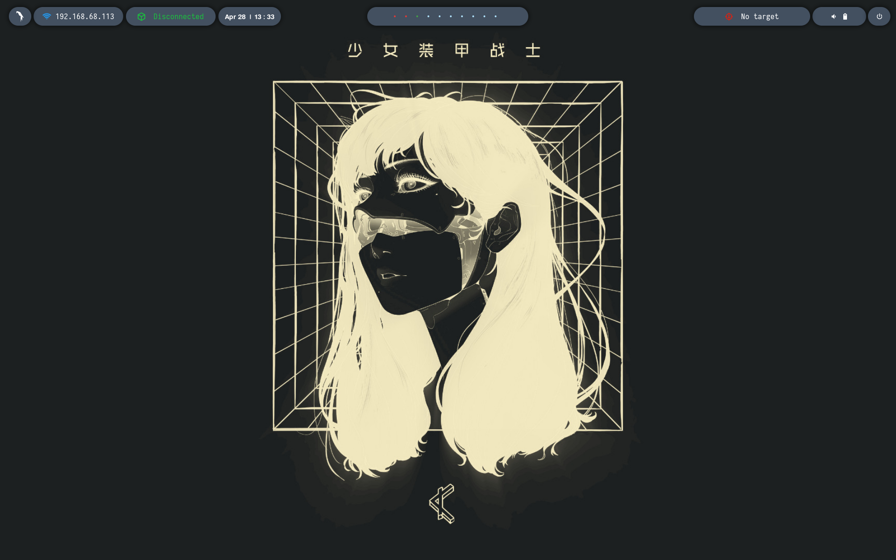
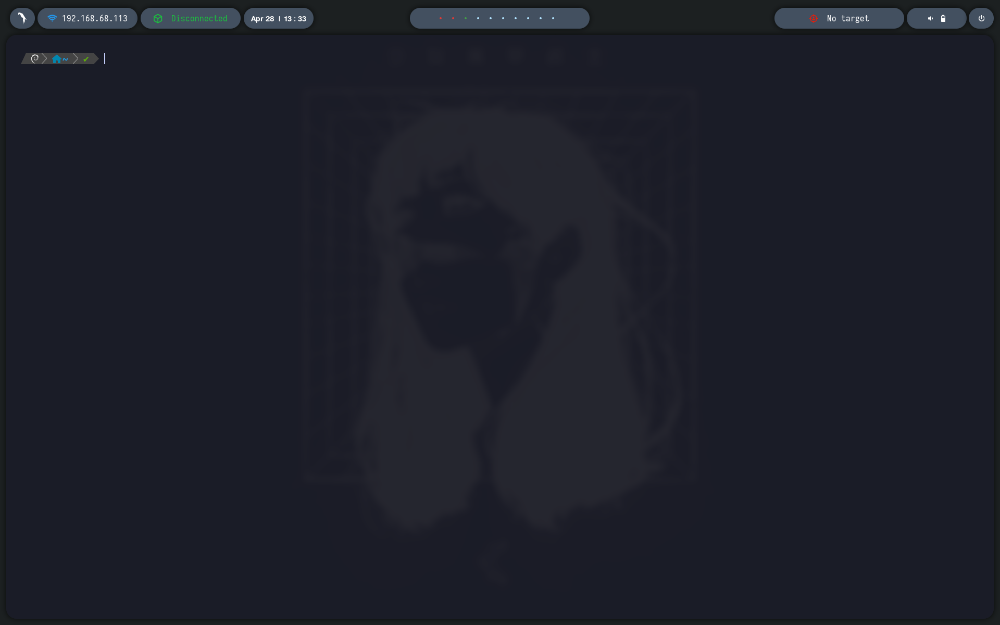
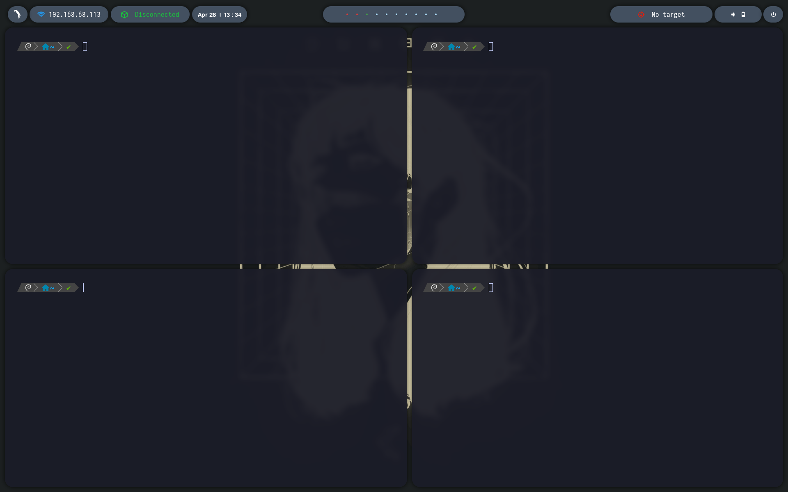

# Autobspwm-ParrotOS 🦅🔥

[](https://parrotsec.org/)
[](https://github.com/baskerville/bspwm)
[](https://github.com/romkatv/powerlevel10k)
[](https://neovim.io/)
[](https://github.com/polybar/polybar)
[](LICENSE)

Instalador automatizado e interactivo para desplegar un entorno de trabajo profesional, minimalista y de alto rendimiento basado en **BSPWM** sobre **Parrot Security OS** y **Kali Linux**, con soporte planificado para Arch Linux.

El proyecto incluye un rice estético moderno (Nord / Tokyo Night), compositor Picom de ultra bajo consumo, barra de estado Polybar en 8 islas modulares, OSD en tiempo real para volumen y brillo, terminal Kitty, utilidades de pentesting integradas y sincronización total de entorno con el usuario **root** (icono de la llama `󰈸`).

---

## 📸 Galería Visual

### Vista General del Escritorio (Polybar modular, fondo y escritorios)


### Terminal Kitty (Tokyo Night, Powerlevel10k, blur dual-kawase y padding)


### Tiling en BSPWM (Gestión dinámica de ventanas y gaps)


---

## ✨ Características Principales

- 🚀 **Instalador Interactivo y Autónomo:** Menú con banners ASCII en color, confirmaciones paso a paso, prechequeo de dependencias y opción de instalación desatendida (`-y`).
- 🪟 **Gestión de Ventanas Avanzada:** `bspwm` y `sxhkd` con atajos ergonómicos, redimensionamiento inteligente (`bspwm_resize`) y reglas para ventanas flotantes.
- 🏝️ **Polybar en 8 Islas Modulares:**
  1. *Log / Logo*: Menú interactivo de aplicaciones.
  2. *Ethernet Status*: Detección automática de la interfaz de red activa (Wi-Fi o cable Ethernet).
  3. *VPN Status*: Detección dinámica y priorizada para `tun*` (HackTheBox / TryHackMe / OpenVPN), `wg*` (WireGuard) y `tailscale*`.
  4. *Secondary Bar*: Fecha y hora con formato extendido.
  5. *Workspaces (Centro)*: Renderizado interactivo de los escritorios virtuales (`I` al `X`).
  6. *Target Status*: Monitor en vivo para objetivos de pentesting (`settarget` / `cleartarget`).
  7. *Primary Bar*: Menú de apagado, reinicio, suspensión y bloqueo de sesión.
- 🔔 **Notificaciones y OSD con Dunst:** Tema Nord integrado, bordes redondeados (12px), anulación de servicios D-Bus para evitar colisiones con MATE y barras de progreso fluidas para el control de volumen y brillo en pantalla.
- ⚡ **Compositor Picom de Alto Rendimiento:** Desenfoque `dual_kawase`, sombras suaves, esquinas redondeadas (20px), sincronización vertical (`vsync = true`) y seguimiento de daños (`use-damage = true`) para evitar el consumo excesivo de CPU y ahorrar batería en laptops.
- 🔍 **Lanzador Rofi:** Modo `drun` con iconos y tema moderno `rounded-nord-dark.rasi`.
- 💻 **Terminal Kitty & Editor Neovim:** Paleta Tokyo Night, pestañas con estilo Powerline y suite Neovim preconfigurada con NvChad.
- 🐚 **Zsh + Powerlevel10k:** Autocompletado enriquecido con colores, historial persistente, plugins (`autosuggestions`, `syntax-highlighting`, `sudo`) y utilidades CLI modernas (`lsd`, `batcat`, `fzf`, `xclip`).
- 🎯 **Funciones de Pentesting Integradas en Shell:**
  - `extractPorts`: Parsea capturas grepeables de Nmap, formatea la salida y copia automáticamente los puertos abiertos al portapapeles.
  - `settarget` / `cleartarget`: Configura o limpia la IP y nombre del objetivo en Polybar.
  - `mkt`: Genera en un segundo la estructura estándar de directorios para auditorías (`nmap/`, `content/`, `exploits/`).
  - `ClearCache`: Script de mantenimiento que limpia cachés de APT, Flatpak, Thumbnails, pip, compilaciones de Go y logs de systemd.
- 󰈸 **Paridad Completa con Usuario Root:** Sincronización automática de Zsh, Neovim, Kitty y prompt de Powerlevel10k personalizado con el distintivo icono de la llama (`󰈸`).
- 🔤 **Tipografías Incluidas:** Familia completa de `Hack Nerd Font` (12 variantes), `Iosevka Nerd Font`, `Hurmit Nerd Font Mono`, `Helvetica` y `Feather Icons`.
- 🛡️ **Seguridad y Respaldo:** Backup automático fechado en `~/.backup-autobspwm/` antes de tocar cualquier archivo, con scripts de restauración (`restore.sh`) y desinstalación limpia (`uninstall.sh`).

---

## 📋 Requisitos del Sistema

- **Distribución:** Parrot Security OS 6.x / 7.x, Kali Linux 2024.x / 2025.x (o derivados de Debian).
- **Servidor Gráfico:** X11.
- **Usuario:** Usuario normal con privilegios de `sudo`.
- **Conexión a Internet:** Requerida durante la primera instalación para descargar los paquetes APT y dependencias.

> [!IMPORTANT]
> Ejecuta el instalador con tu usuario normal. Si requieres permisos administrativos, el script solicitará tu contraseña de `sudo` de forma segura.

---

## 🚀 Instalación Rápida

1. **Clona el repositorio en tu máquina:**
   ```bash
   git clone https://github.com/TomasGutierrezOrozco/Autobspwm-ParrotOS.git
   cd Autobspwm-ParrotOS
   ```

2. **Ejecuta el instalador:**
   ```bash
   ./install.sh
   ```

3. **(Opcional) Instalación Desatendida:**
   Si deseas realizar una instalación automática sin preguntas interactivas:
   ```bash
   ./install.sh -y
   ```

4. **Finalizar y Acceder:**
   Una vez completada la instalación, reinicia tu equipo o cierra sesión:
   ```bash
   sudo reboot
   ```
   En la pantalla de inicio de sesión (Display Manager), asegúrate de seleccionar **bspwm** en el menú de sesiones.

---

## ⌨️ Guía Completa de Atajos de Teclado

Los atajos están orquestados por `sxhkd` (`~/.config/sxhkd/sxhkdrc`).

### 1. Lanzadores y Aplicaciones

| Atajo | Acción |
| :--- | :--- |
| `Super + Enter` | Abre la terminal **Kitty** |
| `Super + d` | Lanzador de aplicaciones **Rofi** (modo drun) |
| `Super + Shift + f` | Abre el navegador **Firefox** |
| `Super + Shift + z` | Abre el navegador **Zen** |
| `Super + e` | Abre el explorador de archivos **Caja** |
| `Super + Shift + m` | Abre Minecraft Launcher Oficial |
| `Super + Shift + x` | Bloquea la pantalla con **i3lock-fancy** |
| `Super + Alt + s` | Captura de pantalla interactiva con **Flameshot** |
| `Print` | Captura de pantalla rápida con **Flameshot** |
| `Super + Escape` | Recarga en caliente la configuración de `sxhkd` |

### 2. Control de Ventanas y Layout en BSPWM

| Atajo | Acción |
| :--- | :--- |
| `Super + q` | Cierra la ventana enfocada |
| `Super + Shift + q` | Mata (force-kill) la ventana enfocada |
| `Super + Shift + r` | Reinicia y recarga `bspwm` en caliente |
| `Super + m` | Alterna entre layout tiled (mosaico) y monocle (pantalla completa) |
| `Super + t` | Establece el estado de la ventana en **Tiled** |
| `Super + Shift + t` | Establece el estado en **Pseudo-tiled** |
| `Super + s` | Establece el estado en **Floating** (flotante) |
| `Super + f` | Establece el estado en **Fullscreen** |
| `Super + g` | Intercambia la ventana actual con la ventana más grande |
| `Super + y` | Envía el nodo marcado más reciente al preseleccionado |

### 3. Navegación, Foco y Escritorios Virtuales

| Atajo | Acción |
| :--- | :--- |
| `Super + [← / ↓ / ↑ / →]` | Mueve el foco hacia la ventana en esa dirección |
| `Super + Shift + [← / ↓ / ↑ / →]` | Intercambia posición con la ventana en esa dirección |
| `Super + 1 - 9, 0` | Cambia al escritorio virtual `I` al `X` |
| `Super + Shift + 1 - 9, 0` | Mueve la ventana enfocada al escritorio `I` al `X` |
| `Super + c` / `Super + Shift + c` | Foco en la siguiente / anterior ventana del escritorio |
| `Super + [` / `Super + ]` | Cambia al escritorio anterior / siguiente del monitor actual |
| `Super + Tab` / `Super + \`` | Alterna con el último escritorio o ventana activa |

### 4. Redimensionamiento y Movimiento

| Atajo | Acción |
| :--- | :--- |
| `Super + Alt + [← / ↓ / ↑ / →]` | Redimensionamiento dinámico en pasos fluidos con `bspwm_resize` |
| `Super + Ctrl + Shift + [Flechas]` | Desplaza una ventana flotante 20px en esa dirección |
| `Super + Ctrl + Alt + [Flechas]` | Preselecciona la dirección de apertura de la próxima ventana |
| `Super + Ctrl + Alt + Espacio` | Cancela la preselección de la ventana enfocada |

### 5. Control Multimedia y OSD en Pantalla

| Tecla / Atajo | Acción |
| :--- | :--- |
| `XF86AudioRaiseVolume` | Sube el volumen un 5% y actualiza el OSD en tiempo real |
| `XF86AudioLowerVolume` | Baja el volumen un 5% y actualiza el OSD en tiempo real |
| `XF86AudioMute` | Alterna el silenciado (Mute) con indicador visual |
| `XF86MonBrightnessUp` | Aumenta el brillo de pantalla un 5% con OSD |
| `XF86MonBrightnessDown` | Reduce el brillo de pantalla un 5% con OSD |
| `Super + Alt + t` | Alterna entre activar o desactivar el Touchpad (`synclient`) |

### 6. Control Multi-Monitor (`xrandr`)

| Atajo | Acción |
| :--- | :--- |
| `Super + Alt + e` | Extiende la pantalla al monitor externo a la izquierda |
| `Super + Alt + m` | Duplica la pantalla (modo espejo nativo) |
| `Super + Alt + Shift + m` | Duplica con escalado automático para resoluciones dispares |
| `Super + Alt + i` | Desactiva pantallas externas y activa solo la pantalla interna |

---

## 🛠️ Funciones de Terminal y Pentesting

Al desplegar Zsh, tendrás disponibles las siguientes herramientas en tu terminal:

```bash
# 1. Extracción de puertos desde Nmap grepeable (-oG):
extractPorts allPorts.gnmap
# -> Muestra IP, puertos abiertos y los copia al portapapeles listos para nmap -sCV

# 2. Configurar objetivo en Polybar:
settarget 10.10.11.245 "CozyHosting"
# -> Muestra en Polybar: 󰯐 10.10.11.245 - CozyHosting

# 3. Limpiar objetivo en Polybar:
cleartarget

# 4. Creación instantánea de estructura de directorios:
mkt
# -> Crea carpetas: nmap/ content/ exploits/

# 5. Limpieza general de cachés y optimización de disco:
ClearCache
```

### Alias de Productividad:
- `ls`, `ll`, `la`, `lla` -> Reemplazados por `lsd` con iconos y directorios primero.
- `cat`, `catn`, `catnp` -> Reemplazados por `batcat` con resaltado de sintaxis.
- `wifi` -> Lanza el asistente interactivo `nmtui`.
- `bluetooth` -> Lanza `blueman-manager`.
- `vpn-on` / `vpn-off` / `vpn-status` -> Control rápido de Tailscale.

---

## 🗂️ Estructura del Repositorio

```text
Autobspwm-ParrotOS/
├── install.sh                  # Instalador maestro interactivo
├── autobspwm                   # Wrapper CLI unificado (install, check, backup, restore)
├── check.sh                    # Validador de dependencias, permisos y seguridad
├── backup.sh                   # Motor de copias de seguridad automáticas
├── restore.sh                  # Restaurador de backups previos
├── uninstall.sh                # Desinstalador seguro con reversión
├── packages/
│   └── apt.txt                 # Lista oficial de paquetes APT requeridos
├── lib/
│   └── common.sh               # Librería común de colores, logging y helpers
├── system/
│   ├── dbus/                   # Prioridad exclusiva para el demonio Dunst
│   └── xsession/               # Registro de sesión para el gestor de login (GDM/LightDM)
└── config/
    ├── bspwm/                  # bspwmrc y scripts (osd, resize, vpn, ethernet, target)
    ├── sxhkd/                  # sxhkdrc con atajos ergonómicos y multimedia
    ├── polybar/                # Arquitectura modular de 8 islas y scripts
    ├── picom/                  # picom.conf (GLX, dual-kawase, use-damage)
    ├── dunst/                  # dunstrc con estilo Nord y barras de progreso
    ├── rofi/                   # config.rasi y temas redondeados
    ├── kitty/                  # kitty.conf (Tokyo Night, powerline tabs, padding)
    ├── nvim/                   # Suite Neovim NvChad completa
    ├── zsh/                    # .zshrc, .p10k.zsh y .p10k-root.zsh (󰈸 flame)
    ├── fonts/                  # Familia completa Hack Nerd Font, Iosevka y Feather
    ├── wallpapers/             # Colección de fondos de pantalla HD
    ├── gtk-2.0/, gtk-3.0/      # Temas oscuros y configuración visual GTK
    └── home/                   # Dotfiles raíz (.fehbg, .Xresources, .gtkrc-2.0)
```

---

## 🔄 Respaldo, Restauración y Desinstalación

### Crear un Respaldo Manual:
```bash
./autobspwm backup
# O directamente:
./backup.sh
```
Los respaldos se almacenan con marca de tiempo en `~/.backup-autobspwm/YYYY-MM-DD_HH-MM-SS/`.

### Restaurar una Copia Previa:
```bash
./autobspwm restore
# O especificar un respaldo concreto:
./restore.sh 2026-09-05_09-45-00
```

### Desinstalar el Entorno:
```bash
./autobspwm uninstall
```
El desinstalador retira las configuraciones instaladas, ofrece restaurar el respaldo original y pregunta si deseas purgar los paquetes instalados.

---

## 🔍 Comprobación de Integridad

Antes o después de desplegar, puedes verificar el estado del entorno ejecutando:

```bash
./check.sh
```

El script validará que todos los ejecutables tengan los permisos correctos, que los paquetes necesarios estén disponibles y garantizará que no exista ninguna fuga de credenciales o rutas privadas.

---

## 🔒 Privacidad y Sanitización (Zero Leakage)

Este repositorio ha sido auditado de forma exhaustiva para asegurar que:
- **No contiene credenciales ni contraseñas.**
- **No contiene direcciones IP privadas** ni referencias a redes locales.
- **No contiene accesos a servidores de almacenamiento o NAS.**
- **No contiene historiales de terminal ni claves SSH/GPG.**
- Todas las rutas a directorios son 100% dinámicas (`$HOME` y variables de entorno estándar).

---

## 📜 Licencia y Créditos

Desarrollado y personalizado por **Tomas Gutierrez (Fu11shoot)**.

Este proyecto está bajo una **Licencia No Comercial Personalizada**. Eres libre de usarlo, estudiarlo y adaptarlo para tu uso personal o profesional en auditorías. Queda prohibida su venta, sublicenciamiento o monetización directa sin autorización previa del autor. Consulta [`LICENSE`](LICENSE) para más detalles.
